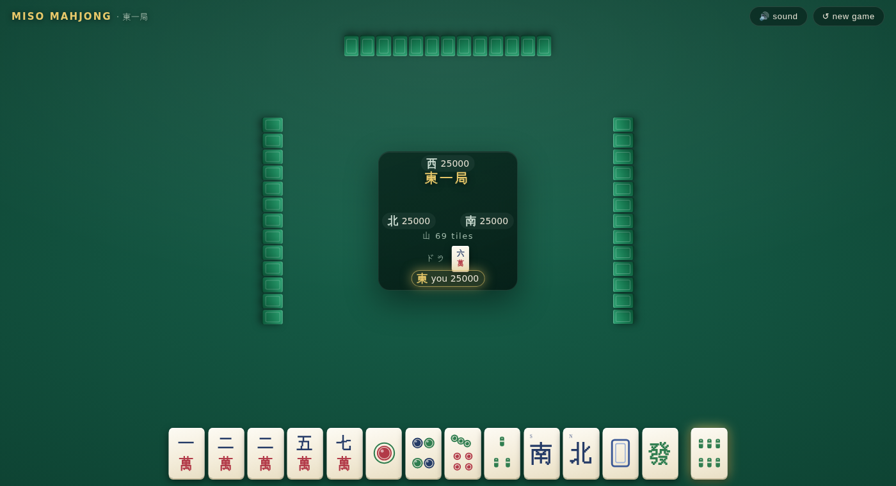

# 🀄 miso-mahjong

Riichi-style **Mahjong** — you vs. three CPU opponents — built with
[miso](https://github.com/dmjio/miso) and compiled to WebAssembly.




- 🎴 Full 136-tile set, hand-drawn SVG tile faces
- 🧠 Shanten-based CPU opponents that pon, chi, kan, tsumo and ron
- 🀄 Chi / Pon / Kan / Ron / Tsumo claims with a dedicated claim bar
- 🌸 Dora, yaku recognition (tanyao, yakuhai, toitoi, chiitoitsu, honitsu, chinitsu, kokushi, …) and scoring
- 🔊 Sound effects synthesized live with the Web Audio API (zero audio assets)
- ✨ Modern felt-table look: glass panels, gold accents, springy CSS transitions

Play an **East round** (4 hands); highest score takes the crown.

## Build (WASM)

Enter the nix shell and run make:

```bash
nix develop .#wasm --command make
make serve   # serves public/ on :8080
```

## Development

```bash
make build   # wasm32-wasi-cabal build + post-link + copy static
make optim   # wasm-opt + strip
make clean
```

CI builds with nix and deploys `public/` to GitHub Pages on pushes to
`master`.

## Rules notes

Simplified riichi ruleset: East round only, no riichi declarations, no
furiten, open kan is not claimable (concealed kan only), and a hand with
no yaku still wins as a 1-han "chicken hand" (HK style). Dealer wins
score 1.5×; tsumo splits the payment three ways.
