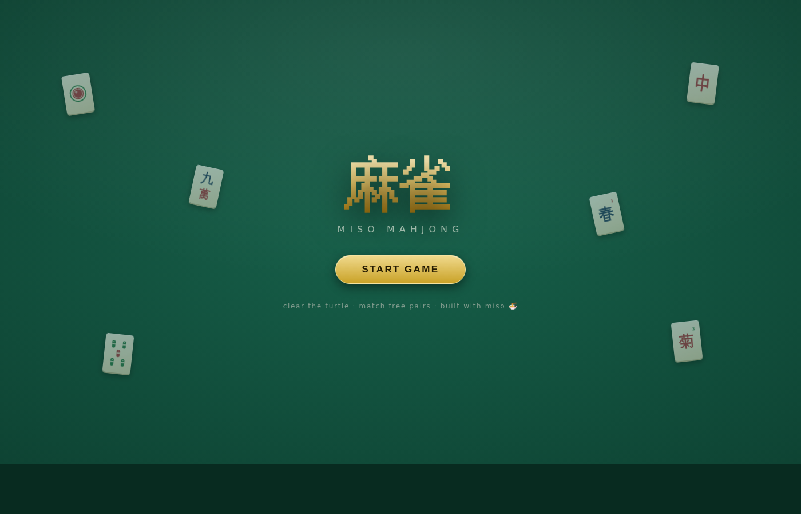
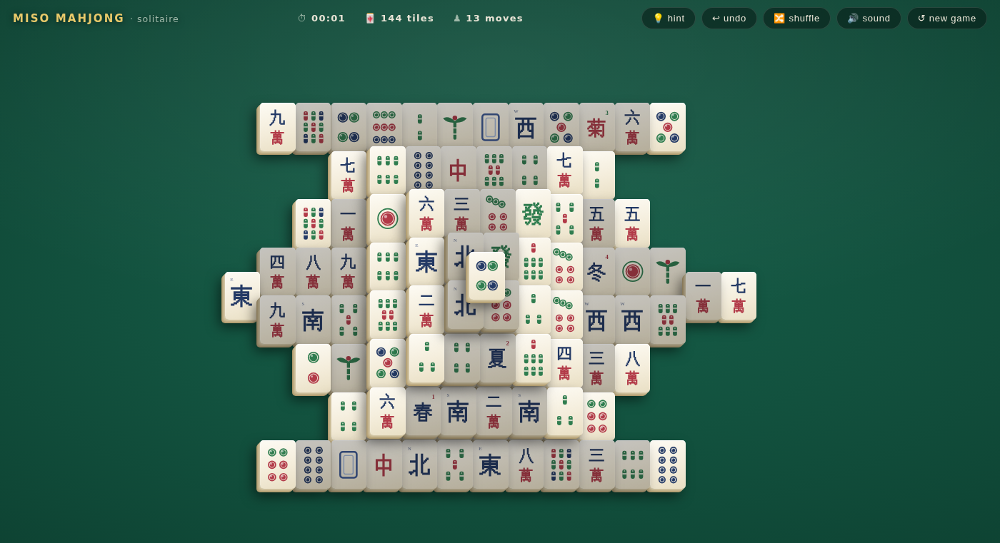

# 🀄 mahjong

**Mahjong solitaire** — clear the classic turtle by matching free pairs —
built with [miso](https://github.com/dmjio/miso) and compiled to
WebAssembly.

**Play it live: <https://mahjong.haskell-miso.org>**





- 🐢 The classic 144-tile turtle: 5 layers, head, and double tail
- 🎴 Hand-drawn SVG tile faces, including flowers 梅蘭菊竹 and seasons 春夏秋冬
- ✅ Every deal is **guaranteed solvable** (dealt by playing the board in reverse) — and so is every shuffle
- 💡 Hint, undo, and shuffle, plus a timer and live move counter
- 🔊 Sound effects synthesized live with the Web Audio API (zero audio assets)
- ✨ Chunky 3D tiles on deep felt: gold accents, glass panels, springy CSS transitions

## Rules

Click two matching tiles to remove them. A tile is *free* when nothing
rests on top of it and at least one of its left/right sides is open.
Flowers match any flower; seasons match any season; every other tile
matches its identical twin. Clear all 144 tiles to win.

## Build (WASM)

Enter the nix shell and run make:

```bash
nix develop .#wasm --command make
make serve   # serves public/ on :8080
```

## Development

```bash
make build   # wasm32-wasi-cabal build + post-link + copy static
make optim   # wasm-opt + strip
make clean
```

CI builds with nix and deploys `public/` to GitHub Pages on pushes to
`master`.
